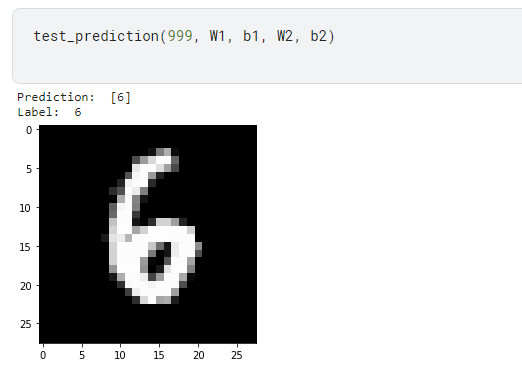

# Neural network from scratch

implement neural network from scratch following a youtube [tutorial](https://www.youtube.com/watch?v=w8yWXqWQYmU)

Code is on kaggle, [here](https://www.kaggle.com/code/aaroncwatkins/mnist-from-scratch)

## Example of testing the model

